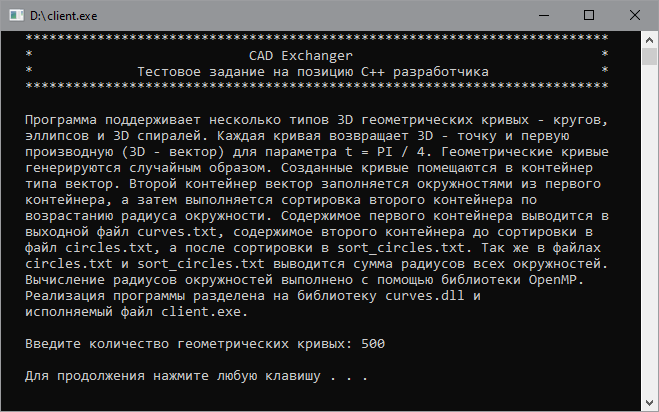

# CAD Exchanger
## Внешний вид приложения

## Описание программы
Программа поддерживает несколько типов 3D геометрических кривых – кругов,
эллипсов и 3D спиралей. Каждая кривая возвращает 3D - точку и первую 
производную (3D - вектор) для параметра t = PI / 4. Геометрические кривые 
генерируются случайным образом. Созданные кривые помещаются в контейнер 
типа вектор. Второй контейнер вектор заполняется окружностями из первого 
контейнера, а затем выполняется сортировка второго контейнера по 
возрастанию радиуса окружности. Содержимое первого контейнера выводится в 
выходной файл curves.txt, содержимое второго контейнера до сортировки в 
файл circles.txt, а после сортировки в sort_circles.txt. Так же в файлах 
circles.txt и sort_circles.txt выводится сумма радиусов всех окружностей.
Вычисление радиусов окружностей выполнено с помощью библиотеки OpenMP.
Реализация программы разделена на библиотеку curves.dll и 
исполняемый файл client.exe.
Разработка программы выполнена в среде Microsoft Visual Studio 2019.